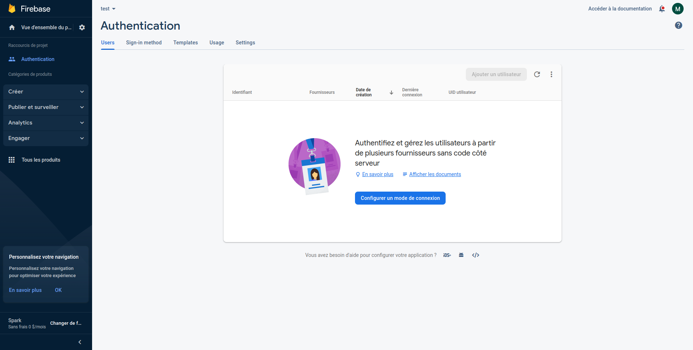
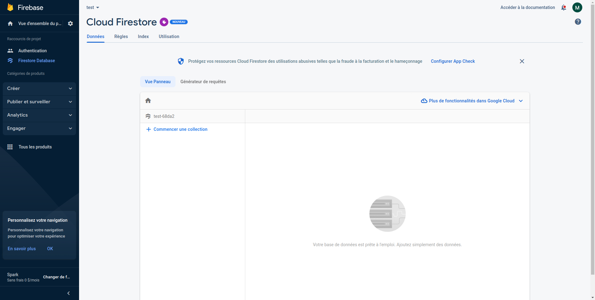
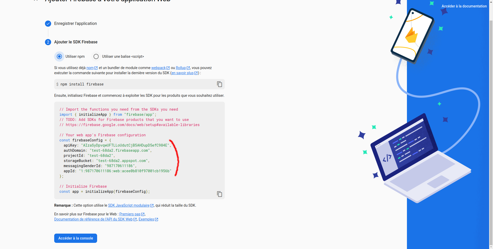

# Picsou

A little program permitting to check and follow comptability in real time 

## Installation

`Picsou` requires following dependancies :

- Firestore database

### Dependancies

#### 1 - Creation of firebase project and security management

To work, this program requires the creation of a firestore database. To do this, follow this link https://console.firebase.google.com/u/0/ 

Create a project (you can call it as you want). 

Once you are on the main page of your project, click on the "create" tab on the left of the screen and select "authentication". Now, click on "start" button and you will come on this screen : 





Now, go "sign-in method" and select "email/password" in native providers and activate the option before save. 

Now you can now manage all user for your application. The application don't have actually a method to sign in and register directly from the app so each user should be insert manually in the database. 

To do that, go on the tab users and click on "add user" and fill field with your information.


#### 2 - Database Creation

Once the authentication has been set up, you need to create the firestore database. 

Click on the "create" tab on the left of your screen and select firestore database. 

Click on the "create a database" button, select "production" option and click on next, select the location for your cloud following your preferences and then click on activate.

You will come on this screen :





Now go on rules tab on the top of the page and change the code by the following one : 

```

rules_version = '2';
service cloud.firestore {
  match /databases/{database}/documents {
    match /{document=**} {
      allow read, write: if
          request.auth != null;
    }
  }
}

```

Finally, click on "submit" button to save new rules

### Picsou Deposit

Clone the Picsou project.

Configure a production `.env` (`cp .env.example .env`):

```

REACT_APP_API_KEY=""
REACT_APP_AUTH_DOMAIN=""
REACT_APP_PROJECT_ID=""
REACT_APP_STORAGE_BUCKET=""
REACT_APP_MESSAGING_SENDER_ID=""
REACT_APP_APP_ID=""

```

To fill each field, you should go on your project firebase home page and add an application web :


Call the application as you want, and now copy all information display here in your `.env` :





Click on "add to the console" and now you can close this website.


Now you have just to launch the application : `docker-compose up -d`

The application is now available here : http://127.0.0.1:10132/ (**without https**)

## License

This application is the intellectual property of leptimax, all rights reserved.